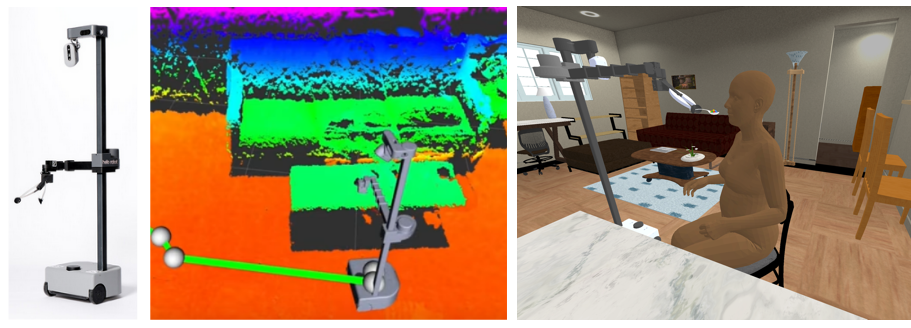

# 16-887: Robotic Caregivers and Intelligent Physical Collaboration

## Course Info

[**Syllabus**](https://docs.google.com/document/d/1YuGsLEHY-cYkI0e8NIz5HTtkMquaZ6brL2-2ra0Hlp8/edit?usp=sharing)

**Time**: Monday & Wednesday 1:25 - 2:45 PM  
**Location**: NSH 3002  
**Instructor**: [Zackory Erickson](https://zackory.com)  
**Office Hours**: Wednesday 3 - 4 PM  
**Course Questions and Discussion**: Slack -- Registered students will be added

## Course Description

Robotics researchers and futurists have long dreamed of robots that can serve as caregivers. In this project-based course, you'll learn about intelligent physical human-robot collaboration and opportunities for robots that contribute to caregiving. You'll gain hands-on experience with teleoperation, autonomy, perception, navigation, manipulation, human-robot interaction, and machine learning. You'll also learn about robot design, collaborative research, and healthcare robotics.

This is a graduate-level project-based course for students interested in physical human-robot collaboration and robotic caregiving. There are no exams nor textbook assignments. You will be working with a group of your peers to develop solutions to real-world problems in which robots physically interact with and assist people. There are two projects where you will work with real mobile manipulators and build on state-of-the-art methods from scientific literature, all leading to a live robot demonstration, presentation, and short paper to disseminate your results.

### Pre-Requisites
Prior experience with the Python programming language is encouraged and extremely beneficial. 
